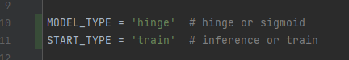

# tlab_align_gpt2
Тестовое задание для лаборатории Тинькофф
___________
Слишком поздно вспомнил про тестовое задание, поэтому не успел красиво оформить гитхаб, а также в работе присутствует несколько минусов:
1. Все сравнения и выводы делались на том же наборе промптов, что и алайнмент.
2. Маленький набор промптов для алайнмента (50 штук)
3. Настройка параметров через глобальные константы внутри файла main.py
4. Установка окружения через requirements.txt
5. Нет графиков(

____________
Помимо всего этого, я бы хотел сказать спасибо за такой классный проект! Мне определенно понравилось над ним работать и я скорее всего для себя вторую часть доделаю, это очень интересно!
_________

Для запуска потребуется NVIDIA GPU, я протестировал в Колабе и на домашнем компе с 6гб видеопамяти

step by step:
1. pip install -r requirements.txt
2. python -m main.py 

По умолчанию запускается алайнмент с помощью hinge лосса

В самом верху исполняемого файла main.py можно поменять тип алайнмента и train/inference (обработчика ошибок тоже нет, так что перед инференсом по хорошему сначала заллайнить модель!)

Результаты лежат в папке results, там можно сравнить получившиеся значения diversity и логитов, а также сами тексты.

_______________

Из получившихся значений можно сделать вывод, что hinge loss позволяет добиться лучшего аллайнмента при меньше потере разнообразия
(Хотя за такое время и с таким качеством исследования полностью подтвердить ее не представляется возможным, требуется дальнейшее исследование)

_____________________
В качестве следующих шагов проверки гипотезы стоит конечно провести те же сравнения на контрольный выборке, состоящей из промптов, которые не участвовали в процессе аллайнмента,
а также увеличить саму выборку. 

Также имеет смысл посмотреть на гиперпараметры DPOtrainer (beta), посмотреть как
он влияет на разнообразие и качество аллайнмента.

